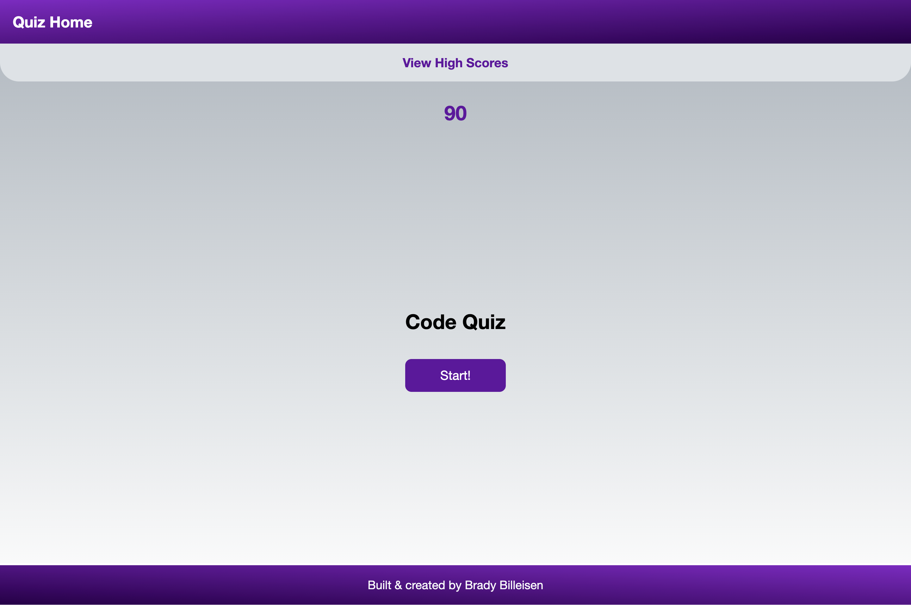

# Code Quiz
By Brady Billeisen

## Description
For this project I had to create a Code Quiz application. To do this I first created variables that used a query selector to grab all the elements I needed to use as well as a "state" variable so I could manipulate the data within it. I then wrote a setView function that took in a parameter of "view" and called it within my event listeners so that it will change the view accordingly. From there I built several different functions that set a timer (and reset it each time the quiz is finished), looped through my questions and choices and displayed each one on the screen as the user clicks their answer until they get to the end, then would ask for the users initials, save that to the local storage, and then if the user clicked the "View High Scores" it would then display a table for all the players initials and their scores.

## Acceptance Criteria
```
GIVEN I am taking a code quiz
WHEN I click the start button
THEN a timer starts and I am presented with a question
WHEN I answer a question
THEN I am presented with another question
WHEN I answer a question incorrectly
THEN time is subtracted from the clock
WHEN all questions are answered or the timer reaches 0
THEN the game is over
WHEN the game is over
THEN I can save my initials and my score
```

## Visuals

.png)
.png)
.png)

## Resources
[Deployed Site](https://brady-billeisen.github.io/code-quiz/)

[GitHub Repository](https://github.com/brady-billeisen/code-quiz)

## License
I used an MIT license for this project.
